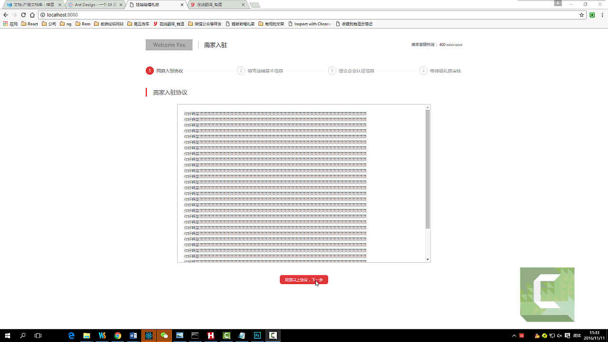

# react-PC
利用react全家桶以及蚂蚁金服antd开发商户注册流程

#目录介绍
* merchants/main.jsx  是入口JS
* config文件夹是配置文件目录
* mock 里面存放mock数据，可以配置拦截ajax请求参照demo
* merchants/component/public文件夹下存放公用的组件以及样式
* merchants/component/business文件夹下面存放业务组件

#安装步骤
* npm install -g webpack
* npm install(可以npm 安装比较慢，可以使用淘宝镜像cnpm 安装，不知道怎么安装的可以百度)

#技术选型
* ES6
* React
* React-dom
* React-Redux
* Redux
* React-Router
* antd
* babel-preset-stage-0
* less
* reqwest ajax模块
* mockjs (完美模拟ajax请求)

#辅助开发插件
* redux-thunk
* redux-logger
* redux-devtools(默认是关闭的注释掉了，如果要用请自行放开,一个是main.jsx，一个是config文件夹下面的store.dev.jsx)

#打包命令
* 先运行npm run dll 剥离第三方库
* npm start  开发运行环境
* npm run build   生产打包环境

#如果对你有所帮助，欢迎点赞

